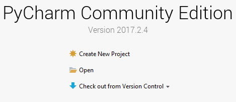
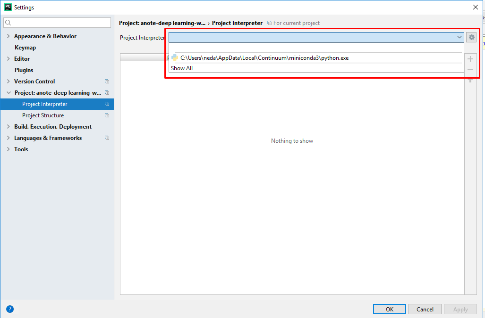
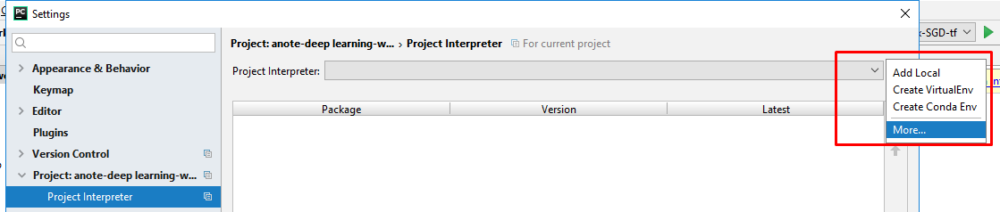
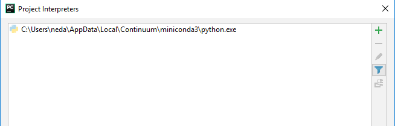
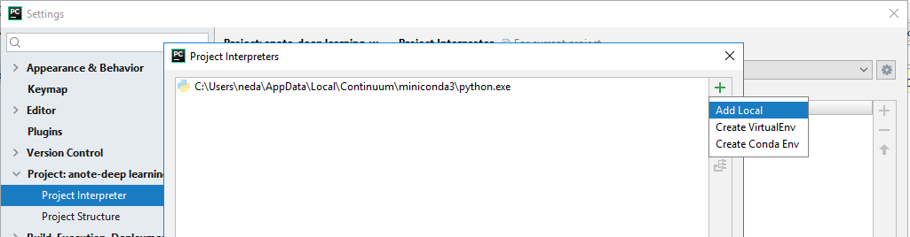
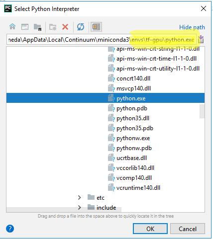

# Quick guide for installing Python, Tensorflow, and PyCharm on Windows
This guide shows you **how to install Python and Tensorflow**. Moreover, it shows how to install and configure **PyCharm** IDE which is a widely used IDE among Python programmers. The installation steps were tested multiple times, especially with the following configurations:<br>   Windows 10, CUDA 9.0, cuDNN 7.1, Tensorflow 1.9, python 3.6<br>&nbsp;&nbsp;&nbsp;Windows 10, CUDA 9.0, cuDNN 7.1, Tensorflow 1.8, python 3.5.2<br>
&nbsp;&nbsp;&nbsp;Windows 10, CUDA 8.0, cuDNN 6.0, Tensorflow 1.4, python 3.5.2<br>

Some points:<br>

- If you do not want to use GPU, simply omit the steps 2 to 4 that are related to CUDA and cuDNN.
- CUDA must be compatible with cuDNN. Before downloading CUDA, check cuDNN's download page.
- The steps 3 to 5 can be replaced with just one command! `conda install tensorflow-gpu==1.9`. [Here](<https://towardsdatascience.com/tensorflow-gpu-installation-made-easy-use-conda-instead-of-pip-52e5249374bc>) you can find out more about this approach.
- The below steps are shown with paths in my system which are slightly differs with paths in your system.


# Installation Steps

## 1- Install the latest Anaconda or Miniconda

Anaconda is a Python distribution which not only includes Python but also includes a large selection of useful packages. Miniconda is a mini version of Anaconda with less pre-installed packages.

First, download [Anaconda](https://www.anaconda.com/distribution/)/[Miniconda](https://docs.conda.io/en/latest/miniconda.html) and then proceed with the installation. During the installation, check “Add Anaconda to my PATH”. Now, you can use Python.

**Example**: Hello World in Python!

```
# 1. Run Anaconda prompt (Start Menu -> Anaconda3 -> Anaconda Prompt)
# 2. Issue "python" command
(base) C:\Users\ashkan\Documents>python
>>>print('Hello World!')
>>>import sys
>>>sys.version
...
>>>exit()
```

## 2- (OPTIONAL) Install Visual Studio 2015 - Community Edition

[Here](https://stackoverflow.com/questions/44290672/how-to-download-visual-studio-community-edition-2015-not-2017), you can find a link to download Visual Studio Community Edition.

Not having a pre-installed visual studio will result in some **warnings** during installation of CUDA. They warn you that some features might not be installed correctly!. However, you can safely skip this step.

## 3- Install CUDA Toolkit

Let’s assume that we want to install CUDA 9.0. Then, follow these steps:

1- Download CUDA from [https://developer.nvidia.com/cuda-downloads](https://developer.nvidia.com/cuda-downloads)

2- Check the CUDA Toolkit is correctly set to path. Run a command prompt, then type `nvcc --version`. You will get:

```
(base) C:\Users\ashkan\Documents>nvcc --version
nvcc: NVIDIA (R) Cuda compiler driver
Copyright (c) 2005-2017 NVIDIA Corporation
Built on Fri_Sep__1_21:08:32_Central_Daylight_Time_2017
Cuda compilation tools, release 9.0, V9.0.176
```

The CUDA installation directory is something like this: `C:\Program Files\NVIDIA GPU Computing Toolkit\CUDA\v9.0`. The `nvcc` is located in the `bin` directory inside this path. 

Note: `nvcc` is the **NV**IDIA **C**UDA **C**ompiler. So, with `nvcc`, you can compile a C/C++ project which uses GPU via CUDA. There are also some companion samples with the CUDA toolkit which are located at `C:\ProgramData\NVIDIA Corporation\CUDA Samples\v9.0`. However, for using Tensorflow, you do not need to use `nvcc`and compile any of these samples.

## 4- Install cuDNN Library

First, download a suitable version from <https://developer.nvidia.com/cudnn. Here, I downloaded cuDNN 7.1 which is compatible with CUDA 9.0. Second, Extract the cuDNN files into the **CUDA installation directory**. Third, Check the Environment Variables: 

Go to `Control Panel` -> `System` -> `Advanced system settings` -> `Advanced` -> `Environment Variables` -> In  `System variables` section:<br> Set the variables `CUDA_HOME`, `CUDA_PATH`, and `CUDA_PATH_V9` to `C:\Program Files\NVIDIA GPU Computing Toolkit\CUDA\v9.0`

Check `Path Variable` contains all of the followings:<br>`C:\Program Files\NVIDIA GPU Computing Toolkit\CUDA\v9.0\bin`<br>`C:\Program Files\NVIDIA GPU Computing Toolkit\CUDA\v9.0\libnvvp`<br>`C:\Program Files\NVIDIA GPU Computing Toolkit\CUDA\v9.0\lib\x64`<br>`C:\Program Files\NVIDIA GPU Computing Toolkit\CUDA\v9.0\extras\CUPTI\libx64`<br>`C:\Program Files\NVIDIA Corporation\NVSMI`<br>If you find that one of these values does not exist in your system’s path, please enter it manually.

## 5- Install Tensorflow

From your start menu, launch “Anaconda Prompt”. Then, install Tensorflow using one of the following commands:

- `pip install tensorflow` -  To install Tensorflow without GPU support.
- `pip install tensorflow-gpu`

However, running the above commands will install the latest Tensorflow on your `base` environment which might not be something that you want. 

**Due to compatibility issues, we often want to install specific versions of Tensorflow and Python.** Especially, when we need the GPU version of the Tensorflow. The `conda create --name` command in Anaconda/Minicona allows us to easily create a new environment with more control over the package installation.

**Example**: Let't install a GPU version of Tensorflow 1.9 over Python 3.6 in a new environment called `tf-gpu`. Here are the instructions:

```shell
# Run Anaconda prompt (Start Menu -> Anaconda3 -> Anaconda Prompt)
(base) C:\Users\ashkan\Documents> conda create -n tf-gpu python=3.6
(base) C:\Users\ashkan\Documents> activate tf-gpu

(tf-gpu) C:\Users\ashkan\Documents> pip install tensorflow-gpu==1.9

# Test Tensorflow!
(tf-gpu) C:\Users\ashkan\Documents>python
Python 3.6.8 |Anaconda, Inc.| (default, Dec 30 2018, 18:50:55) [MSC v.1915 64 bit (AMD64)] on win32
Type "help", "copyright", "credits" or "license" for more information.
>>> import tensorflow as tf
>>> tf.__version__
'1.9.0'
>>>exit()
(tf-gpu) C:\Users\ashkan\Documents>
```

Now you have two separate environments: 1- `base`, and 2- `tf-gpu`. The `base` environment is the default environment when you running the "Anaconda Prompt". You did not create this environment explicitly and it was created by Anaconda/Miniconda. 

Activating an environment: `activate environment_name` or `conda activate environment_name` <br>Listing all the environments:  `conda env list`<br>Deactivating the current environment and returning to the "base": `deactivate`

## 6- (OPTIONAL) Install PyCharm IDE

Assuming that you have successfully installed Anaconda/Miniconda and Tensorflow. The following steps will show you  how to install PyCharm integrated development environment (IDE) which is widely used for the Python programming language.

1. Download the “community edition” of PyCharm from [here](https://www.jetbrains.com/pycharm/download/#section=windows). Run the installation package.

2. Throughout the installation wizard, remember to check “Download and install JRE ….”. Then, follow the
   wizard with its default settings.

3. After installation is finished, launch PyCharm. Then, create a new project or open a project using a
   folder that currently contains Python files.

   

4. When you open a python file, you will see a notice:


You need to configure a python interpreter for this project. Click on it. Then, you see something like this window:



You can select the interpreter from the list. However, if you have multiple environments, you need
to select an interpreter which activate that environment. Here, we want to activate  `tf-gpu`. So, do the following steps:



The “Project Interpreters” window will open:



Then select “add local”:



Select the interpreter which is located under the folder “tf-gpu”:



That’s all. Press OK! to save settings and close the windows.
